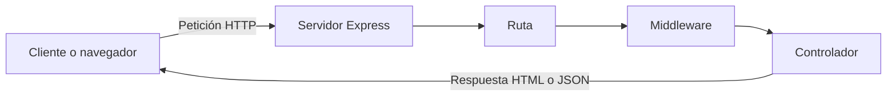

# TP Integrador JavaScript

Aplicación web desarrollada con Node.js y Express para la gestión de usuarios. Esta primera parte corresponde al Módulo 6 y establece la estructura base del servidor para incorporar posteriormente una base de datos, operaciones CRUD y autenticación.

## Objetivo

Construir una aplicación web organizada y modular que permita servir contenido HTML, responder datos en formato JSON y registrar las visitas realizadas a sus rutas.

## Node.js y Express

Node.js es un entorno de ejecución que permite utilizar JavaScript fuera del navegador. Se utiliza para desarrollar aplicaciones del lado del servidor, herramientas de línea de comandos y API web.

Express es un framework para Node.js que facilita la creación de servidores web. Proporciona herramientas para definir rutas, utilizar middlewares, servir archivos estáticos y gestionar las peticiones y respuestas HTTP.

En comparación con Node.js puro, Express permite desarrollar un servidor con una estructura más sencilla, clara y modular.

## Flujo cliente-servidor



1. El cliente solicita una dirección desde el navegador.
2. Express recibe la petición y busca la ruta correspondiente.
3. El middleware registra la visita en `log.txt`.
4. El controlador genera una respuesta HTML o JSON.
5. El servidor envía la respuesta al cliente.

## Requisitos del sistema

- Node.js versión 18 o superior.
- npm.
- Git.

El proyecto fue desarrollado utilizando Node.js `v24.20.0` y npm `12.0.2`.

## Tecnologías utilizadas

- Node.js.
- Express.
- Dotenv.
- Nodemon.
- Módulo nativo `fs`.

## Instalación

Clonar el repositorio:

```bash
git clone URL_DEL_REPOSITORIO
```

Ingresar al proyecto:

```bash
cd tp-integrador-js
```

Instalar las dependencias:

```bash
npm install
```

Crear un archivo `.env` tomando como referencia `.env.example`:

```env
PORT=3000
```

## Ejecución

Para ejecutar la aplicación normalmente:

```bash
npm start
```

Para ejecutar la aplicación en modo de desarrollo con Nodemon:

```bash
npm run dev
```

El script `start` utiliza Node.js para iniciar la aplicación. El script `dev` utiliza Nodemon para reiniciar automáticamente el servidor cuando se modifica un archivo JavaScript.

## Ejemplos de uso

### Página principal

```text
http://localhost:3000/
```

Devuelve contenido en formato HTML y utiliza estilos almacenados en la carpeta `public`.

### Estado del servidor

```text
http://localhost:3000/status
```

Devuelve una respuesta en formato JSON con el estado del servidor.

## Registro de visitas

Las visitas a las rutas `/` y `/status` son registradas en:

```text
logs/log.txt
```

Cada registro contiene la fecha, la hora, el método HTTP y la ruta visitada. Para conservar los registros anteriores, se utiliza el método `fs.appendFile()`.

Ejemplo:

```text
09-09-2026, 10:30:15 | GET | /
09-09-2026, 10:30:20 | GET | /status
```

## Estructura del proyecto

```text
tp-integrador-js/
├── controllers/
│   └── mainController.js
├── logs/
│   └── log.txt
├── middlewares/
│   └── visitLogger.js
├── public/
│   └── css/
│       └── style.css
├── routes/
│   └── mainRoutes.js
├── services/
│   └── logService.js
├── .env.example
├── .gitignore
├── app.js
├── package.json
├── package-lock.json
└── README.md
```

La estructura separa las responsabilidades de la aplicación:

- `routes`: define las direcciones disponibles.
- `controllers`: genera las respuestas HTML y JSON.
- `middlewares`: ejecuta operaciones antes de los controladores.
- `services`: contiene la lógica para guardar los registros.
- `public`: almacena los archivos estáticos.
- `logs`: conserva el historial de accesos.

## Decisiones técnicas

### Elección de `app.js`

Se eligió `app.js` como archivo principal porque representa claramente el punto de entrada y la configuración general de la aplicación Express.

### Uso de la carpeta `public`

Se utilizó `public` para almacenar y servir los estilos CSS mediante el middleware `express.static()`. Esto permite separar los archivos estáticos de la lógica del servidor.

### Arquitectura modular

Las rutas, los controladores, los middlewares y los servicios se encuentran separados para evitar concentrar toda la lógica en `app.js`. Esta organización facilita el mantenimiento y la incorporación de nuevas funciones.

### Variables de entorno

El puerto se configura mediante Dotenv para evitar escribir configuraciones directamente en el código. El archivo `.env.example` muestra las variables necesarias para ejecutar el proyecto.

## Reflexión técnica

El principal aprendizaje de esta etapa fue comprender cómo Node.js y Express trabajan juntos para recibir peticiones y generar respuestas. La separación del proyecto en carpetas permite identificar mejor la responsabilidad de cada componente.

También se aplicó persistencia básica mediante archivos planos. El uso de un middleware permite registrar cada visita antes de ejecutar el controlador correspondiente.

Esta estructura deja preparada la aplicación para integrar una base de datos, operaciones CRUD, relaciones entre entidades y autenticación mediante JWT en las siguientes etapas.
